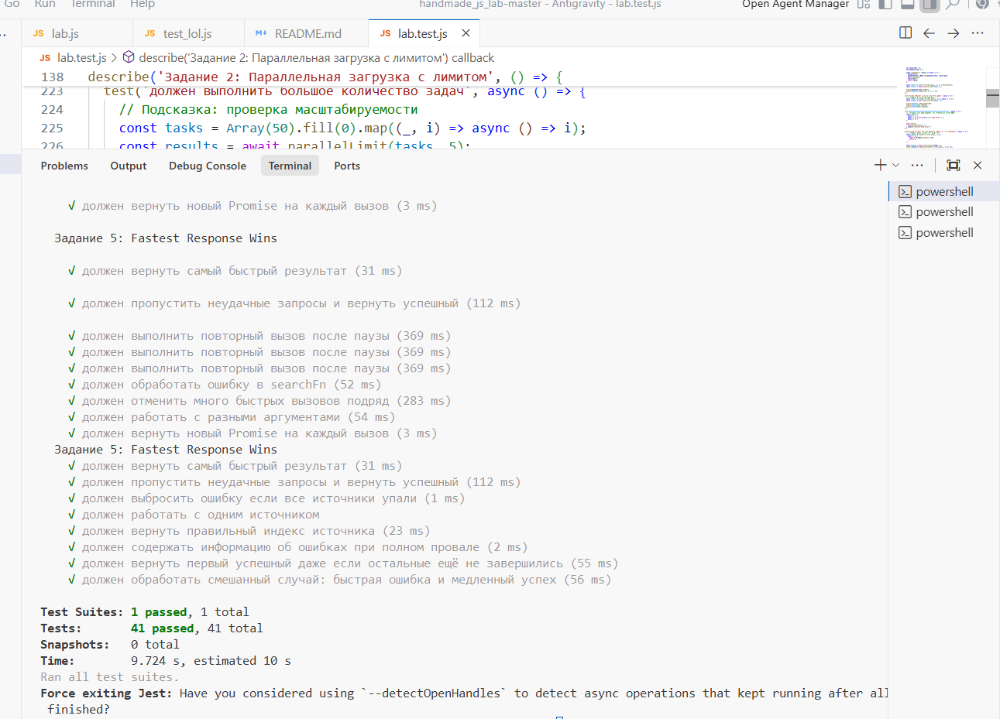

# Лабораторная работа: Асинхронное программирование в JavaScript

В проекте реализованы **5 практических заданий**, охватывающих ключевые аспекты работы с:
- промисами
- конкурентностью
- оптимизацией асинхронных операций
---

## Выполненные задания

### Задание 1: Smart API Fetcher
Реализована функция **`smartFetch()`** для выполнения API-запросов с таймаутом, автоматическими повторами и сбором метрик.

**Основные возможности:**
- Настраиваемый таймаут выполнения
- Логика повторных попыток при ошибках
- Измерение времени выполнения и количества попыток

---

### Задание 2: Параллельная загрузка с лимитом
Реализована функция **`parallelLimit()`** для параллельного выполнения задач с ограничением на количество одновременных операций.

**Особенности:**
- Использование паттерна **Worker Pool**
- Сохранение порядка результатов
- Эффективное использование ресурсов

---

### Задание 3: Умное кэширование запросов
Реализована функция **`createCachedFunction()`** для кэширования результатов с поддержкой TTL и дедупликации.

**Функционал:**
- Кэширование по сериализованным аргументам
- Автоматическая инвалидация кэша по времени
- Предотвращение дублирующих запросов

---

### Задание 4: Поиск с debounce
Реализована функция **`createDebouncedSearch()`** для оптимизации частых поисковых запросов.

**Преимущества:**
- Сокращение количества запросов к серверу
- Отмена устаревших вызовов
- Настраиваемая задержка выполнения

---

### Задание 5: Fastest Response Wins
Реализована функция **`fetchFromFastest()`** для получения данных из нескольких источников.

**Стратегия:**
- Параллельное выполнение всех запросов
- Возврат первого успешного результата
- Детальная информация об ошибках
---

## Результаты тестирования
Все реализации успешно прошли тестирование:

- **Общее количество тестов:** 41  
- **Пройдено тестов:** 41 / 41 (100%)  
- **Покрытие кода:** Полное
---

